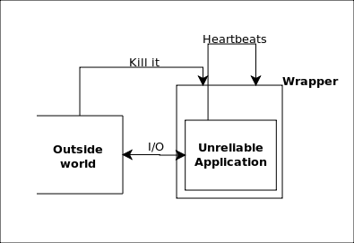

#Introduction

A tiny wrapper to execute applications in, which will wait for heartbeats from
the applications, restart them if they miss too many heartbeats and if they
crash (exit with a non-zero return value).

##Reliability

Making applications reliable is difficult. Nay, it is impossible. Horrible
things will happen to critical applications. You can blame
[Murphy](http://en.wikipedia.org/wiki/Murphy%27s_law) if you want, but that is
not going to improve your plight.

###Some failures

Among all the things which can go wrong with the application, few are fairly common (and easily diagnosable):

1. Dying unnaturally (possibly because of much loved [SIGSEGV](http://en.wikipedia.org/wiki/SIGSEGV))
2. Never dying ([deadlocks](http://en.wikipedia.org/wiki/Deadlock), [livelocks](http://en.wikipedia.org/wiki/Deadlock#Livelock),
[Infinite loops](http://en.wikipedia.org/wiki/Infinite_loop), etc.)
3. Aberrant behaviour ([Byzantine
faults](http://en.wikipedia.org/wiki/Byzantine_fault_tolerance#Byzantine_failures),
expletives in communication, physical violence, etc.)

##Solution

The ideal solution would be to actually fix the problem, that is fix the
program. However, often it is not possible (e.g., unpredictable closed-source
libraries underneath) or not desirable (a few bazillion lines of code to sift
through). 

Hence, there are _workarounds_ to these two common problems, and this wrapper
presents a very basic way of how some level of reliability may be given in
*your* home-brewed application before you move onto the
[heavy-weights](http://zookeeper.apache.org/).

Now dealing with unnatural deaths is fairly easy: just run the wrapper as a
subprocess and if it exits with a non-zero error code, restart it.

Dealing with infinite loops is trickier. Heartbeats are a promising solution,
but 
[getting them right is difficult](http://zguide.zeromq.org/page:all#Heartbeating). One simple way of
doing them is making them a part of the
[REPL](http://en.wikipedia.org/wiki/Read%E2%80%93eval%E2%80%93print_loop),
making it a _Read-Eval-HeartBeat-Print-Loop_.

, as I have done
here.

Lastly, detecting aberrant behaviour is too domain specific a problem to be
addressed by a wrapper. For all the wrapper knows, you probably wanted to write
a violent program. Hence, the wrapper has a big red panic button on top which
anyone from the outside world can press. Hopefully, the one who presses this button
would do it only when he has good reasons to. What possibly could go wrong?

###ZMQ

[ZeroMQ](http://www.zeromq.org/) is the method of [asynchronous
I/O](http://en.wikipedia.org/wiki/Asynchronous_I/O) between the wrapper and the
underlying application. The heartbeats as well as commands are sent to the
wrapper using this ZMQ sockets. Any other way of asynchronous input/output
would also fix the problem.

#Requirements

+ [ZMQ library](http://www.zeromq.org/intro:get-the-software)
+ [pyzmq](https://github.com/zeromq/pyzmq): Can be installed using _easy_install pyzmq_
+ Linux (or [any other system which supports UNIX style sockets](http://api.zeromq.org/2-1:zmq-ipc))

#Contents

+ *cmd_kill.py* is an example of how to press the red panic button.
+ *random_app.py* is a program which has arrhythmia and randomly quits working, or just crashes. This is a pretty good model of a sample program.
+ *run_monitor.py* runs the program

